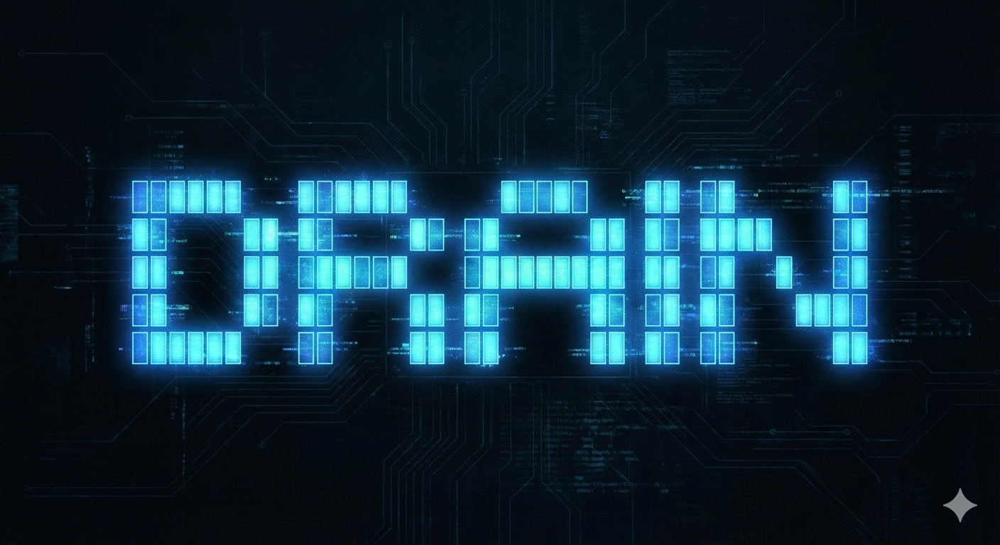
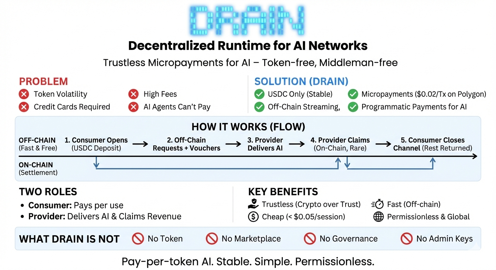

# DRAIN

<div align="center">
  
</div>

**Decentralized Runtime for AI Networks**

An open protocol for trustless, streaming micropayments between AI consumers and providers.

[](./LICENSE)
[](./CONTRIBUTING.md)
[](https://ethereum-magicians.org/t/erc-8184-draft-payment-channels-with-signed-vouchers-streaming-micropayments-for-ai-agents/28012)

> **[ERC-8190](https://ethereum-magicians.org/t/erc-8184-draft-payment-channels-with-signed-vouchers-streaming-micropayments-for-ai-agents/28012)**: This protocol is being formalized as an Ethereum standard — *Payment Channels with Signed Vouchers*. The ERC defines the minimal interface for unidirectional payment channels using EIP-712 signed vouchers, complementary to [ERC-8183](https://eips.ethereum.org/EIPS/eip-8183) (Agentic Commerce).

---

<div align="center">

### ⚡ Superior to Per-Request-Providers.

</div>

```
╔══════════════════════════════════════════════════════════════════════════════╗
║                           1000 AI REQUESTS                                   ║
╠══════════════════════════════════════════════════════════════════════════════╣
║                                                                              ║
║   DRAIN              │  Per-Request Payments (x402, etc.)                    ║
║   ─────              │  ────────────────────────────────                     ║
║   2 transactions     │  1000 transactions                                    ║
║   ~$0.04 gas         │  ~$20+ gas                                            ║
║   0ms latency        │  2-5 sec per request                                  ║
║   1 wallet popup     │  1000 wallet popups (or API key)                      ║
║                                                                              ║
╚══════════════════════════════════════════════════════════════════════════════╝
```

<div align="center">

| 🏦 **2 On-Chain TXs** | ⚡ **Zero Latency** | 💸 **~$0.04 Total Gas** | 🔐 **No API Keys** |
|:---:|:---:|:---:|:---:|
| Open + Close only | Off-chain vouchers | 500x cheaper at scale | Cryptographic auth |

</div>

---

## Why DRAIN?

Existing decentralized AI protocols require holding volatile tokens, creating speculation dynamics that overwhelm utility. Meanwhile, **78% of the world lacks credit cards**, and AI agents can't have bank accounts.

DRAIN fills this gap: **stablecoin micropayments without tokens, complexity, or intermediaries.**

| Problem | DRAIN Solution |
|---------|----------------|
| Token volatility | USDC-only, predictable pricing |
| High fees | ~$0.02 per tx on Polygon (varies: $0.015-0.025) |
| AI agents can't pay | First-class programmatic support |
| Credit card barriers | Permissionless crypto access |

## Overview

DRAIN enables permissionless, pay-per-token AI inference without intermediaries. Users open payment channels with USDC, stream requests to any compatible provider, and settle on-chain only when needed.

**Core Principles:**

* **Minimal** – The protocol defines only what's necessary
* **Permissionless** – Anyone can be a provider or consumer
* **Trustless** – Cryptography replaces trust
* **Immutable** – No admin keys, no upgrades, no fees

## How It Works

DRAIN is like a **prepaid card for AI**: deposit USDC, use it across requests, withdraw the remainder.

<div align="center">
  
</div>

```
┌──────────────────────────────────────────────────────────────────┐
│                        Off-Chain (Fast & Free)                   │
│                                                                  │
│    Consumer                                      Provider        │
│        │                                             │           │
│        │───────── Request + Voucher ────────────────►│           │
│        │◄──────── AI Response ───────────────────────│           │
│        │───────── Request + Voucher ────────────────►│           │
│        │◄──────── AI Response ───────────────────────│           │
│        │                    ...                      │           │
│                                                                  │
└────────┼─────────────────────────────────────────────┼───────────┘
         │                                             │
         │              On-Chain (Rare)                │
         ▼                                             ▼
┌──────────────────────────────────────────────────────────────────┐
│                        DRAIN Contract                            │
│                                                                  │
│     open(provider, amount, duration)    →  Lock USDC             │
│     claim(channelId, amount, signature) →  Pay provider          │
│     close(channelId)                    →  Refund remainder      │
└──────────────────────────────────────────────────────────────────┘
```

### The Two Roles

| Role | What They Do | On-Chain Actions |
|------|--------------|------------------|
| **Consumer** | Pays for AI services | `open` (deposit), `close` (refund) |
| **Provider** | Delivers AI responses | `claim` (withdraw earnings) |

### Consumer Flow

1. **Open Channel**: Deposit USDC for a specific provider and duration (~$0.02 gas, ~5 sec finality)
2. **Use Service**: Send requests with signed vouchers (free, off-chain, $0.000005 per request)
3. **Close Channel**: Withdraw unused USDC after expiry (~$0.02 gas, ~5 sec finality)

### Provider Flow

1. **Receive Request**: Validate voucher signature and amount
2. **Deliver Service**: Return AI response
3. **Claim Payment**: Submit highest voucher to get paid (~$0.02 gas, ~5 sec finality)

### Channel Duration & Provider Protection

The **consumer sets the channel duration** when opening (e.g., 24h). But providers control their requirements:

| Provider Can... | How |
|-----------------|-----|
| **Require minimum duration** | Reject vouchers from channels < X hours |
| **Recommend duration** | Document in API: "We recommend 24h channels" |
| **Claim anytime** | No deadline until consumer calls `close()` |

**Key insight:** Even after channel expiry, the provider can claim as long as the consumer hasn't closed. The consumer must actively call `close()` – it's not automatic.

### Vouchers Are Cumulative

Each voucher contains the **total** amount spent, not the increment:

```
Request 1: voucher.amount = $0.10  (total spent so far)
Request 2: voucher.amount = $0.25  (total, not $0.15 increment)
Request 3: voucher.amount = $0.40  (total, not $0.15 increment)
```

Provider only needs to claim the **last** voucher to receive full payment.

### Payment Currency

| Asset | Network | Why |
|-------|---------|-----|
| **USDC** | Polygon | Stable ($1), liquid ($500M+), low fees (~$0.02/tx, varies: $0.015-0.025) |

USDC on Polygon can be bridged from Ethereum, Base, Arbitrum via [Circle CCTP](https://www.circle.com/en/cross-chain-transfer-protocol).

## Handshake58 Marketplace

The official DRAIN marketplace is **Handshake58** - a provider directory where AI agents can discover and pay for AI inference.

| Link | Description |
|------|-------------|
| **https://www.handshake58.com** | Main marketplace |
| **https://www.handshake58.com/for-agents** | Quick start for AI agents |
| **https://www.handshake58.com/api/mcp/providers** | Provider discovery API |

### For AI Agents

Install the MCP Server and start using AI with crypto payments:

```bash
npm install -g drain-mcp
```

Configure in Claude Desktop or Cursor:

```json
{
  "mcpServers": {
    "drain": {
      "command": "drain-mcp",
      "env": {
        "DRAIN_PRIVATE_KEY": "your-polygon-wallet-key"
      }
    }
  }
}
```

That's it! The MCP server auto-discovers providers from Handshake58.

### Agent-Oriented Endpoints

| URL | Purpose |
|-----|---------|
| `/for-agents` | Static, crawlable agent page |
| `/api/agent` | Quick discovery JSON |
| `/llms.txt` | 25-line agent instruction |
| `/skill.md` | Full documentation (MCP first) |

---

## Protocol Specification (ERC-8190)

DRAIN implements **[ERC-8190: Payment Channels with Signed Vouchers](https://ethereum-magicians.org/t/erc-8184-draft-payment-channels-with-signed-vouchers-streaming-micropayments-for-ai-agents/28012)** — an Ethereum standard for streaming micropayments via EIP-712 signed vouchers.

| Component                | Description                                      | Standard |
| ------------------------ | ------------------------------------------------ | -------- |
| **Smart Contract** | Escrow and settlement logic (`IPaymentChannel`) | ERC-8190 (normative) |
| **Voucher Format** | EIP-712 typed signatures for off-chain payments  | ERC-8190 (normative) |
| **Service Interaction** | HTTP 402 discovery, cost reporting, error codes | ERC-8190 (RECOMMENDED) |
| **API Standard**   | OpenAI-compatible interface with payment headers | Application layer |

The protocol intentionally excludes provider discovery, reputation systems, dispute resolution, and governance. See [ERC-8183](https://eips.ethereum.org/EIPS/eip-8183) (Agentic Commerce) and [ERC-8004](https://eips.ethereum.org/EIPS/eip-8004) (Trustless Agents) for complementary standards.

Full specification: See `contracts/` for the Solidity implementation and the [ERC-8190 draft](https://github.com/ethereum/ERCs/pull/1592) for the formal standard.

## Security Model

| Party | Protected Against | How |
|-------|-------------------|-----|
| **Consumer** | Overcharging | Only signs amounts they agree to |
| **Consumer** | Non-delivery | Stops signing, refunds after expiry |
| **Provider** | Overspending | `amount ≤ deposit` enforced on-chain |
| **Provider** | Double-spend | USDC locked in contract, not wallet |

EIP-712 signatures with `chainId` and `verifyingContract` prevent replay attacks. OpenZeppelin ECDSA provides malleability protection.

## Voucher Format

```solidity
// EIP-712 typed data
struct Voucher {
    bytes32 channelId;
    uint256 amount;  // Cumulative total spent
    uint256 nonce;   // Incrementing per voucher
}
```

Consumer signs vouchers off-chain. Provider submits latest voucher to claim payment.

## Economics

| Role | Cost |
|------|------|
| **Consumer** | ~$0.02 open + provider rate + ~$0.02 close |
| **Provider** | ~$0.02 claim gas, keeps 100% of fees |
| **Protocol** | Zero fees |

Total overhead: **<$0.05** per session regardless of usage.

**Minimum Deposit Recommendations:**
- **$0.10**: Testing (40% gas overhead, ~100 messages)
- **$0.50**: Recommended minimum (8% gas overhead, ~500 messages)
- **$1.00**: Optimal (4% gas overhead, ~1000 messages)
- **$5.00**: Best value (0.8% gas overhead, ~5000 messages)

See [Test Results](docs/AGENT_TEST_RESULTS.md) for verified cost data.

## What DRAIN Is NOT

| ❌ | Why |
|----|-----|
| Token | No speculation, no governance drama |
| Marketplace | Discovery is separate, built on top |
| Reputation system | Out of scope, can be layered |
| Upgradeable | Immutable contracts, no admin keys |

## Project Structure

```
drain/
├── contracts/                  # Solidity smart contracts
│   ├── src/DrainChannel.sol    # Core payment channel contract
│   ├── test/                   # 47 Foundry tests
│   └── script/                 # Deploy scripts
├── sdk/                        # TypeScript SDK
│   ├── src/consumer.ts         # Consumer: open, sign, close
│   └── src/provider.ts         # Provider: verify, claim
├── provider/                   # Reference AI Provider
│   ├── src/index.ts            # Express server (OpenAI-compatible)
│   └── src/drain.ts            # Voucher validation
├── mcp/                        # MCP Server for AI Agents
│   ├── src/index.ts            # MCP server entry point
│   └── src/tools/              # drain_chat, drain_balance, etc.
└── demo/                       # AI-optimized examples
    ├── README.md               # Quick start for AI agents
    └── simple-demo.ts          # Minimal code example
```

## MCP Server (Agent-to-Agent) ✅ **VERIFIED**

DRAIN includes an MCP (Model Context Protocol) server that enables AI agents to autonomously pay for AI services.

**✅ Successfully tested with Claude Desktop** - An AI agent autonomously opened a $0.10 channel and made AI inference requests, proving the agent-to-agent payment economy works without human intervention.

**Test Results**: $0.000005 per request, 20,000 requests possible with $0.10 channel. See [Test Results](docs/AGENT_TEST_RESULTS.md) and [Comparison with Credit Cards](docs/COMPARISON.md) for detailed metrics.

```bash
npm install -g drain-mcp
```

Configure in Cursor or Claude:

```json
{
  "mcpServers": {
    "drain": {
      "command": "npx",
      "args": ["-y", "drain-mcp"],
      "env": {
        "DRAIN_PRIVATE_KEY": "0x..."
      }
    }
  }
}
```

**Available Tools:**

| Tool | Description |
|------|-------------|
| `drain_providers` | Discover AI providers |
| `drain_balance` | Check wallet balance |
| `drain_open_channel` | Open payment channel |
| `drain_chat` | AI chat with payment |
| `drain_close_channel` | Close channel, get refund |

See [`mcp/README.md`](./mcp/README.md) for full documentation.

## SDK Quick Start

```bash
npm install @drain-protocol/sdk viem
```

```typescript
import { createDrainConsumer, CHAIN_IDS } from '@drain-protocol/sdk';

// Open channel, sign vouchers, close when done
const consumer = createDrainConsumer(walletClient, account, {
  chainId: CHAIN_IDS.POLYGON_MAINNET,
});

await consumer.approveUsdc('10');
const { channelId } = await consumer.openChannel({
  provider: '0x...',
  amount: '10',
  duration: '24h',
});

const voucher = await consumer.signVoucher(channelId, '0.50');
// Send voucher to provider...
```

See [`sdk/README.md`](./sdk/README.md) for full documentation.

## Reference Provider

OpenAI-compatible API server that accepts DRAIN payments.

**🟢 Live Provider:** https://drain-production-a9d4.up.railway.app/v1/pricing

### Available Models & Pricing

| Model | Input/1K Tokens | Output/1K Tokens | ~Cost/Message |
|-------|-----------------|------------------|---------------|
| **gpt-4o-mini** | $0.000225 | $0.0009 | ~$0.001 ✨ |
| gpt-4o | $0.00375 | $0.015 | ~$0.01 |
| gpt-4-turbo | $0.015 | $0.045 | ~$0.03 |
| gpt-3.5-turbo | $0.00075 | $0.00225 | ~$0.002 |

*Prices include 50% margin over OpenAI base rates*

**Run your own:**

```bash
cd provider
cp env.example .env  # Configure OPENAI_API_KEY, PROVIDER_PRIVATE_KEY
npm install
npm run dev
```

**Endpoints:**
```
GET  /v1/pricing          → View pricing per model
GET  /v1/models           → List available models  
POST /v1/chat/completions → Chat (with X-DRAIN-Voucher header)
```

**DRAIN Headers:**
```http
# Request
X-DRAIN-Voucher: {"channelId":"0x...","amount":"1000000","nonce":"1","signature":"0x..."}

# Response
X-DRAIN-Cost: 8250
X-DRAIN-Total: 158250
X-DRAIN-Remaining: 9841750
```

See [`provider/README.md`](./provider/README.md) for full documentation.

## Provider Discovery

DRAIN is a permissionless protocol - anyone can be a provider. Multiple discovery options:

| Method | Best For | Link |
|--------|----------|------|
| **Handshake58** | Humans browsing providers | [Launch App](https://www.handshake58.com) |
| **MCP Server** | AI agents (auto-discovery) | [npm package](https://www.npmjs.com/package/drain-mcp) |
| **Direct Address** | Known provider integration | Use provider wallet address |

The marketplace is **optional** - DRAIN protocol works standalone with any provider address.

## Demo & Examples

**Quick Start for AI Agents**: See [`demo/README.md`](./demo/README.md) for machine-readable examples.

**Live Demo**: https://www.handshake58.com

Try DRAIN without writing code:
1. **Connect Wallet** – MetaMask on Polygon Mainnet
2. **Choose Provider & Model** – Select from available AI models
3. **Open Channel** – Deposit USDC ($0.10 minimum recommended)
4. **Chat** – Each message signs a voucher and calls the real AI ($0.000005 per request)
5. **Close Channel** – Get unused USDC refunded

## Development Status

| Component               | Status         | Link |
| ----------------------- | -------------- | ---- |
| Smart Contract          | ✅ Complete    | [polygonscan](https://polygonscan.com/address/0x1C1918C99b6DcE977392E4131C91654d8aB71e64) |
| Test Suite (47 tests)   | ✅ Complete | `contracts/test/` |
| TypeScript SDK          | ✅ Available | `sdk/` |
| Reference Provider      | ✅ Online | [Railway](https://drain-production-a9d4.up.railway.app/v1/pricing) |
| MCP Server              | ✅ Published | [npm](https://www.npmjs.com/package/drain-mcp) |
| **Handshake58**         | ✅ **LIVE** | **[Launch App](https://www.handshake58.com)** |

### Deployed Contracts

| Network | Contract | Address |
|---------|----------|---------|
| **Polygon Mainnet** | DrainChannelV2 (ERC-8190) | [`0x0C2B3aA1e80629D572b1f200e6DF3586B3946A8A`](https://polygonscan.com/address/0x0C2B3aA1e80629D572b1f200e6DF3586B3946A8A) |
| **Polygon Mainnet** | DrainChannel (V1, immutable) | [`0x1C1918C99b6DcE977392E4131C91654d8aB71e64`](https://polygonscan.com/address/0x1C1918C99b6DcE977392E4131C91654d8aB71e64) |
| Polygon Amoy (Testnet) | DrainChannel | [`0x61f1C1E04d6Da1C92D0aF1a3d7Dc0fEFc8794d7C`](https://amoy.polygonscan.com/address/0x61f1C1E04d6Da1C92D0aF1a3d7Dc0fEFc8794d7C) |

DrainChannelV2 is the production contract used by [Handshake58](https://www.handshake58.com) and the ERC-8190 reference implementation. It adds cooperative close and optional platform fees over V1.


## Getting Started

```bash
git clone https://github.com/kimbo128/DRAIN.git
cd DRAIN/contracts

# Install Foundry if needed: https://book.getfoundry.sh
forge build
forge test -vvv
```

### Test Coverage

```bash
forge test --gas-report  # Gas optimization
forge coverage           # Line coverage
```

## Target Chain

| Chain   | Tx Cost | Finality | USDC Liquidity |
| ------- | ------- | -------- | -------------- |
| Polygon | ~$0.02 (varies: $0.015-0.025) | 5 sec    | $500M+ native  |

**Why Polygon?**
- Native USDC with Circle CCTP bridging
- 5-second finality enables 10-minute challenge periods (300 blocks)
- Proven infrastructure, no reorgs
- Low gas costs (~$0.02 per transaction)

Future chains via CREATE2 for identical addresses.

## FAQ

<details>
<summary><strong>What if the provider doesn't deliver?</strong></summary>

Stop signing vouchers. Your USDC stays locked until expiry, then you can close the channel and get a full refund. The provider can only claim what you've signed.
</details>

<details>
<summary><strong>What if the consumer stops paying?</strong></summary>

Provider stops delivering service and claims the last valid voucher. The consumer's deposit covers all signed vouchers.
</details>

<details>
<summary><strong>Can I use ETH/MATIC instead of USDC?</strong></summary>

No. DRAIN v1 supports only USDC on Polygon. This keeps the protocol simple and prices predictable.
</details>

<details>
<summary><strong>Can I close a channel early?</strong></summary>

No. Channels have a fixed duration (e.g., 24h) to protect providers. After expiry, unused funds are refundable.
</details>

<details>
<summary><strong>When should providers claim?</strong></summary>

Recommended: when accumulated earnings exceed ~$10 (to amortize ~$0.02 gas). Providers can claim **at any time** – before, during, or after channel expiry.
</details>

<details>
<summary><strong>What happens to unclaimed vouchers after expiry?</strong></summary>

**Providers are protected by the channel duration.** Here's the timeline:

```
Channel Open → Provider can claim (anytime) → Channel Expiry → Consumer can close
     │                    │                        │                  │
     └────────────────────┴────────────────────────┴──────────────────┘
                    Provider can claim throughout this entire period
```

- **Provider can claim**: From channel open until consumer calls `close()`
- **Consumer can close**: Only AFTER channel expiry
- **The gap is your protection**: Even after expiry, if the consumer doesn't immediately close, you can still claim

**Example with 24h channel:**
1. Consumer opens channel at 10:00 AM
2. Consumer uses service, signs vouchers worth $5
3. Channel expires at 10:00 AM next day
4. Consumer might close at 2:00 PM (4 hours later)
5. Provider can claim anytime from 10:00 AM Day 1 until 2:00 PM Day 2 (28 hours!)

**Best practice:** Set up monitoring to claim before expiry, but know you have a buffer.
</details>

<details>
<summary><strong>Can I top up a channel?</strong></summary>

No. Open a new channel instead. This keeps the protocol simple and avoids edge cases.
</details>

## Related Projects

| Project | Description | Link |
|---------|-------------|------|
| **Handshake58 Marketplace** | Official provider directory | [https://www.handshake58.com](https://www.handshake58.com) |
| **For AI Agents** | Agent quick start | [https://www.handshake58.com/for-agents](https://www.handshake58.com/for-agents) |
| **Provider API** | Discovery endpoint | [https://www.handshake58.com/api/mcp/providers](https://www.handshake58.com/api/mcp/providers) |
| **MCP Server** | AI agent integration (Claude, Cursor) | [npm](https://www.npmjs.com/package/drain-mcp) |
| **Reference Provider** | Live DRAIN-compatible AI provider | [API](https://drain-production-a9d4.up.railway.app) |

## Contributing

See [`CONTRIBUTING.md`](./CONTRIBUTING.md) for guidelines.

## License

[MIT License](./LICENSE) – Attribution required.

---

<p align="center">
<i>Permissionless AI infrastructure for an open economy.</i>
</p>
